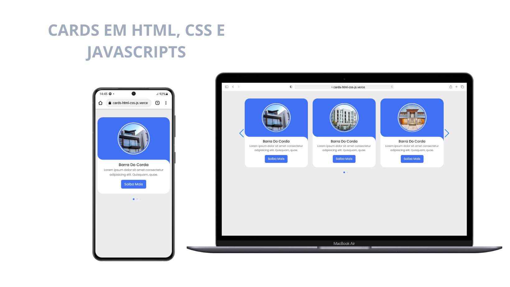

<h1 align="center">CARDS EM HTML, CSS e JavaScript</h1>

  <a href="#-tecnologias">Tecnologias</a>&nbsp;&nbsp;&nbsp;|&nbsp;&nbsp;&nbsp;
  <a href="#-projeto">Projeto</a>&nbsp;&nbsp;&nbsp;

 

  

## 🚀 Tecnologias

Esse projeto foi desenvolvido com as seguintes tecnologias:

- HTML e CSS
- JavaScript
- Git e Github

## 💻 Projeto

Este é o meu mais recente trabalho, uma calculadora de IMC.

- [Acesse o projeto finalizado, online](https://cards-html-css-js.vercel.app/)